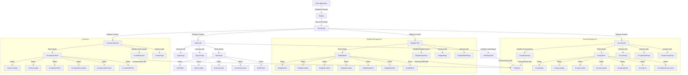

```mermaid
graph TB;
    A[Main Application] -->|Initializes Firebase| B[MyApp]
    B -->|Sets up Providers| C[HomePage]
    C -->|Displays Content| D[AuthCubit]
    C -->|Displays Content| E[GroupCubit]
    C -->|Displays Content| F[BudgetCubit]
    C -->|Displays Content| G[GroupInviteCubit]
    
    D -->|Handles Login/Signup| H[AuthRepoImpl]
    H -->|Communicates with| I[Firebase]
    D -->|Emits States| J[AuthState]
    J -->|States| K[AuthInitial]
    J -->|States| L[AuthLoading]
    J -->|States| M[Authenticated]
    J -->|States| N[Unauthenticated]
    J -->|States| O[AuthFailure]
    D -->|Interacts with| P[LoginPage]
    D -->|Interacts with| Q[SignupPage]
    
    subgraph Group Management
        E -->|Handles Group Actions| R[GroupRepoImpl]
        R -->|Communicates with| I[Firebase]
        E -->|Emits States| S[GroupState]
        S -->|States| T[GroupInitial]
        S -->|States| U[GroupLoading]
        S -->|States| V[GroupCreated]
        S -->|States| W[GroupsLoaded]
        S -->|States| X[GroupUpdated]
        S -->|States| Y[GroupError]
        S -->|States| Z[GroupMembersLoaded]
        E -->|Interacts with| AA[GroupPage]
        E -->|Interacts with| AB[GroupDetailPage]
        E -->|Interacts with| AC[CreateGroupPage]
    end
    
    subgraph Budget Management
        F -->|Handles Budget Actions| AD[BudgetRepoImpl]
        AD -->|Communicates with| I[Firebase]
        F -->|Emits States| AE[BudgetState]
        AE -->|States| AF[BudgetInitial]
        AE -->|States| AG[BudgetLoading]
        AE -->|States| AH[BudgetCreated]
        AE -->|States| AI[BudgetsLoaded]
        AE -->|States| AJ[BudgetUpdated]
        AE -->|States| AK[BudgetDeleted]
        AE -->|States| AL[BudgetError]
        F -->|Interacts with| AM[BudgetPage]
        F -->|Interacts with| AN[BudgetDetailPage]
    end
    
    subgraph Invitations
        G -->|Handles Invite Actions| AO[InviteRepoImpl]
        AO -->|Communicates with| I[Firebase]
        G -->|Emits States| AP[GroupInviteState]
        AP -->|States| AQ[InvitesLoading]
        AP -->|States| AR[InvitesLoaded]
        AP -->|States| AS[GroupInviteSent]
        AP -->|States| AT[GroupInviteAccepted]
        AP -->|States| AU[GroupInviteDeclined]
        AP -->|States| AV[GroupInviteError]
        G -->|Interacts with| AW[InvitesPage]
    end
```
